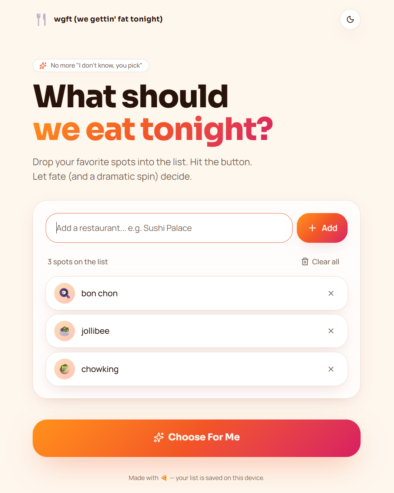
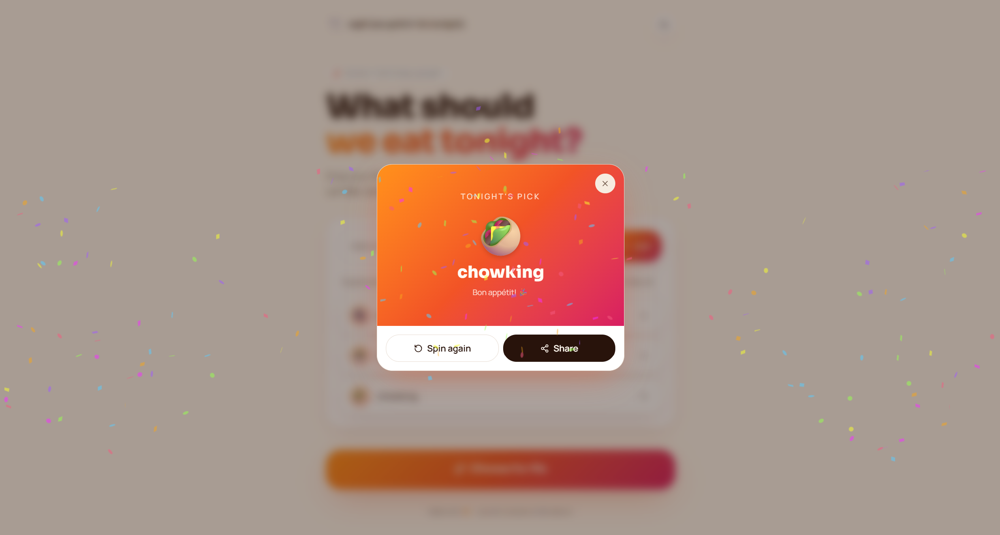

# 🍜 for all the big backs out there, wgft (we gettin' fat tonight)

A fun and modern restaurant picker web app that helps users decide where to eat with a single click.

Users can add restaurant names, spin the chooser, and instantly get a random recommendation with smooth animations, dark mode, and a playful UI experience.

---

## Features

- Add restaurant names to a list
- Randomly choose a restaurant
- Prevent duplicate or empty entries
- Remove individual restaurants
- Clear all restaurants
- Persistent storage using `localStorage`
- Animated roulette/spinner effect
- Confetti celebration on selection
- Dark mode support
- Fully responsive mobile-first design
- Fast and lightweight React app

---

## Preview

> A sleek food decision-maker inspired by modern apps like Spotify, Notion, and food delivery platforms.




---

## Tech Stack

- **React**
- **Tailwind CSS**
- **Vite**
- **React Hooks**
- **localStorage API**

---

## Project Structure

```bash
what-should-we-eat/
│
├── public/
│
├── src/
│   ├── components/
│   │   ├── RestaurantInput.jsx
│   │   ├── RestaurantList.jsx
│   │   ├── RandomPicker.jsx
│   │   ├── ResultModal.jsx
│   │   └── SpinnerWheel.jsx
│   │
│   ├── hooks/
│   │   └── useLocalStorage.js
│   │
│   ├── utils/
│   │   └── randomSelector.js
│   │
│   ├── App.jsx
│   ├── main.jsx
│   └── index.css
│
├── tailwind.config.js
├── package.json
├── vite.config.js
└── README.md
```

---

## Getting Started

### 1. Clone the Repository

```bash
git clone https://github.com/richelleadarlo/wgft-we-getting-fat-tonight.git
```

### 2. Navigate Into the Project

```bash
cd wgft-we-getting-fat-tonight
```

### 3. Install Dependencies

```bash
npm install
```

### 4. Start Development Server

```bash
npm run dev
```

---

## How It Works

1. Enter restaurant names into the input field
2. Add as many choices as you want
3. Click the **“Choose For Me”** button
4. Watch the animated picker spin
5. Get your randomly selected restaurant 🎉

---

## Planned Features

- Restaurant categories/tags
- Favorites and weighted randomness
- Interactive spinning wheel
- Sound effects
- AI-powered suggestions
- Share result button
- Online restaurant search integration

---

## Responsive Design

The app is optimized for:

- Mobile devices
- Tablets
- Desktop screens

---

## Dark Mode

Built-in dark mode support with smooth transitions for a clean modern experience.

---

## Deployment

This project is ready to deploy on:

- Vercel
- Netlify
- GitHub Pages

### Build for Production

```bash
npm run build
```

---

## Contributing

Contributions, ideas, and improvements are welcome.

1. Fork the repository
2. Create a feature branch
3. Commit your changes
4. Open a pull request

---

## License

MIT

---

## Author

Built by **Richelle Adarlo** with ❤️ for indecisive food lovers everywhere.